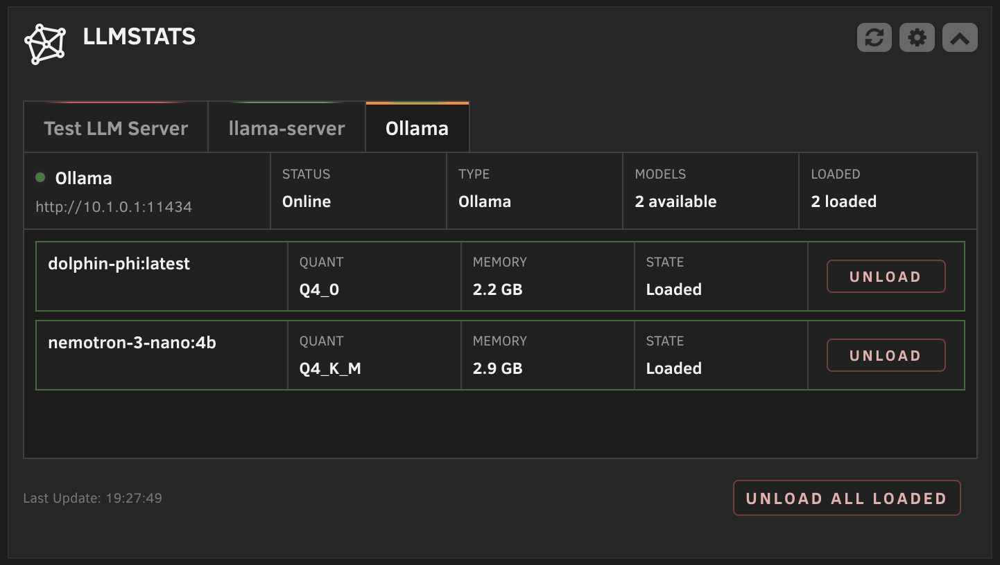
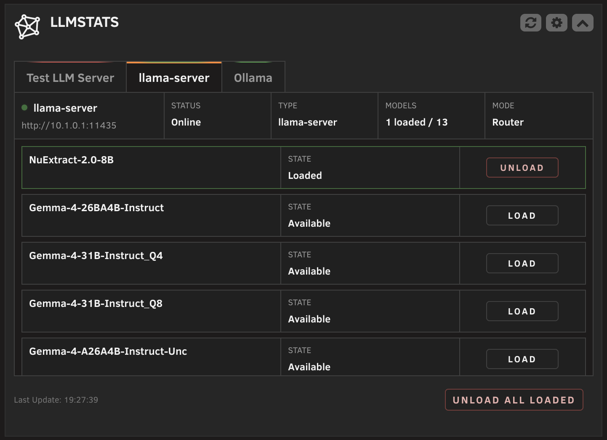
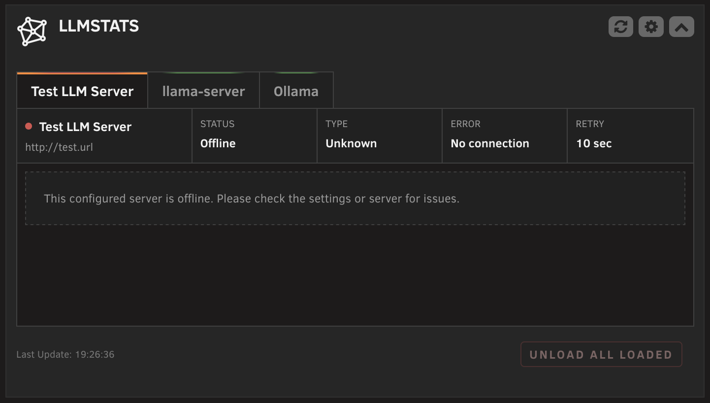

<h1> LLMStats for Unraid</h1>

LLMStats adds a compact dashboard widget that monitors locally hosted LLM servers. It shows server status, available and loaded models, supported model stats, and busy/idle state directly on the Unraid Dashboard, and lets you load or unload models without leaving it.

Supported server types:

- [Ollama](https://ollama.com)
- [llama-server](https://github.com/ggml-org/llama.cpp) (llama.cpp), with full model management in router mode

## Screenshots

<p>
  
  
</p>
<p>
  
</p>

## Features

- Dashboard tile with one tab per configured server, including offline servers.
- Green status glow for online servers, red for offline, orange marker for the selected tab.
- Server status card per tab: connection status, server type, model counts, slot activity, and router mode.
- Model cards with configurable fields per server: quantization, memory, and busy/idle state. Quantization and memory stats are Ollama-only; unsupported fields are unavailable for llama-server.
- Load unloaded models where supported, unload a single model, or unload all loaded models with optional confirmation.
- Server type autodetection with manual fallback.
- Collapsed dashboard state with compact server status chips.
- Configurable refresh interval.
- Light and dark theme support.
- Settings page with server management (add, remove, reorder, test) and setup guidance.

## Requirements

- Unraid 6.9 or newer.
- At least one Ollama or llama-server instance reachable from the Unraid host.
- LLMStats assumes local endpoints that are reachable without credentials. Authentication is currently not implemented.

## Installation

For manual installation:

1. Open the Unraid web interface.
2. Go to **Plugins**.
3. Click **Install Plugin**.
4. Paste this URL and install:

   ```text
   https://raw.githubusercontent.com/jo-sobo/llmstats-unraid-plugin/main/llmstats.plg
   ```

## Configuration

Open **Settings > User Utilities > LLMStats Settings** in the Unraid web interface.

Available settings:

- **Automatic refresh:** Enable or disable dashboard updates.
- **Refresh interval:** Set how often the widget polls the configured servers.
- **Unload confirmation:** Require a confirmation dialog before unload actions.
- **Server configuration:** Add, remove, reorder, and test servers. Each server has a display name, URL, and server type (autodetect, Ollama, or llama-server).
- **Model display:** Choose per server which supported fields appear on model cards. The model name is always shown. Quantization and memory are Ollama-only display stats, so those settings are unavailable for llama-server.

Click **Apply** to save changes. The dashboard widget updates on the next refresh.

## Server Setup

LLMStats only needs the server API to be reachable from the Unraid host. Configure the actual container, models, GPU access, storage, and updates through the official server docs.

### Ollama

Required for LLMStats:

- The Ollama API must be reachable from the Unraid host.
- Ollama must listen on an address reachable from outside its container, not only on container-local loopback.
- The URL saved in LLMStats must exactly match the host, port, and scheme that reach your Ollama API.

Official references:

- [Ollama Docker image](https://hub.docker.com/r/ollama/ollama)
- [Ollama API reference](https://docs.ollama.com/api)

### llama-server

Required for LLMStats:

- The llama-server API must be reachable from the Unraid host.
- llama-server must listen on an address reachable from outside its container, not only on container-local loopback.
- The URL saved in LLMStats must exactly match the host, port, and scheme that reach your llama-server API.
- For model load and unload controls, run llama-server in router mode: do not pass one fixed model file, and provide a model source such as `--models-dir` or `--models-preset`.
- Single-model mode can still show the loaded model, but load and unload controls are unavailable.

Official references:

- [llama-server documentation](https://github.com/ggml-org/llama.cpp/tree/master/tools/server)
- [llama-server README](https://github.com/ggml-org/llama.cpp/blob/master/tools/server/README.md)

## Known Limitations

- Not every server exposes the same metadata; unsupported values are unavailable for that server type.
- Quantization and runtime memory usage are treated as Ollama-only model stats. llama-server is supported, but those model display fields are not configurable for llama-server.
- llama-server features depend on how it was started, especially whether router mode is enabled.

## How It Works

The dashboard widget polls a local plugin API at the configured refresh interval. The plugin probes all configured servers in parallel from the Unraid host, autodetects the server type where requested, and assembles a per-server state with models, metadata, and load state. Load and unload actions are validated against the saved server list and executed server-side.

## Support

Source code and issue tracking are on GitHub:

https://github.com/jo-sobo/llmstats-unraid-plugin/issues


## Donation

If LLMStats is useful to you, donations are welcome:

https://coff.ee/magnum.308

## License

This project is licensed under the GPL v3. See [LICENSE](LICENSE) for details.
